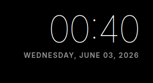

# mirrordash-clock

Clock and date widget with 12h/24h formatting, localizations, and sleek layout sizes for MirrorDash.

## Features
- Displays current time and date in customizable formats.
- Supports 12-hour or 24-hour modes.
- Show/hide seconds toggle.
- Fully localized (Swedish and English) for day/month names.
- Clean HUD design.

## Installation

On the mirror's admin page, open **Modules**: the module is in the list, install it with one click.
Or paste `git+https://github.com/Menturan/mirrordash-clock.git` under **Modules → Install a Module from GitHub**.

Developing it: `uv run pytest` runs its tests, and `uvx mirrordash-sdk validate .` checks it.

## Screenshot

## License
[PolyForm Noncommercial License 1.0.0](LICENSE.md)
